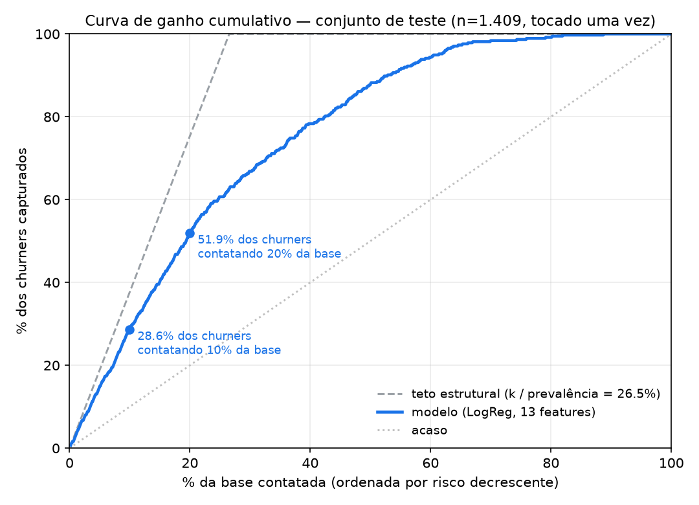
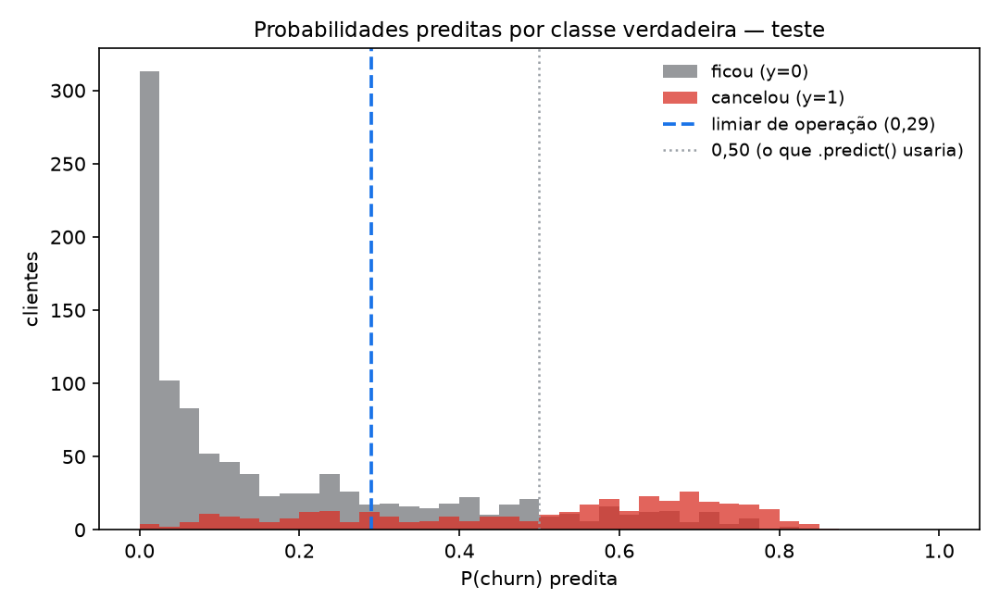

# Relatório da Entrega — Tech Challenge Fase 1
## Predição de churn em telecom: do enquadramento do problema à API em produção

**Pós-graduação em Machine Learning Engineering — FIAP + Alura PosTech**
Autor: Luca Stephan · Modalidade individual · Entrega: 01/09/2026
API em produção: **https://tc-churn-api.onrender.com** · Repositório: `tc-mle-fase1`

---

### Como ler esta entrega

| Documento | O que é | Quando ler |
|---|---|---|
| **`docs/RELATORIO.md`** (este) | a narrativa completa: por que cada decisão foi tomada, com o número que a sustenta | leitura principal |
| `README.md` | como rodar: comandos, endpoints, container, deploy | para reproduzir |
| `MODEL_CARD.md` | ficha do modelo: uso pretendido, usos **proibidos**, fairness, LGPD | governança |
| `docs/decision-log.md` | **o registro de decisões** — 3.000 linhas escritas *durante* a execução, com os experimentos que não deram certo | quando quiser a evidência crua de qualquer afirmação daqui |
| `docs/resultado-teste-final.json` | o registro da leitura única do conjunto de teste | auditoria |

> 🔑 **Sobre o formato.** O `decision-log.md` não é um diário: é o que a literatura de comparação
> de modelos chama de **dossiê do processo** — *"os projetos de comparação geram não só um
> 'vencedor', mas todo um dossiê: métricas, gráficos, testes realizados, considerações de custo"*
> — e algumas empresas adotam exatamente o formato de **"registro de decisões"**, um documento
> anexo a cada modelo em produção que resume os experimentos que o justificaram. Este relatório é
> a leitura desse registro; o registro é a prova.

---

## Sumário executivo

Um ranqueador de risco de cancelamento para a equipe de Retenção de uma operadora de telecom,
servido por uma API pública, com monitoramento, política de retreino, auditoria de fairness e
procedimento de rollback escritos.

| | |
|---|---|
| **Modelo em produção** | Regressão Logística (13 features) dentro de um `Pipeline` com imputação, one-hot e escalonamento |
| **Desempenho — conjunto de teste, tocado uma única vez** | **PR-AUC 0,6496** (piso de um modelo sem informação: 0,2654) · IC95 [0,5960; 0,7016] |
| **Valor operacional** | contatando **10% da base**, a campanha alcança **28,6%** de quem ia cancelar — **75,9% do máximo matematicamente possível** |
| **Valor em reais** | custo do erro **R$ 32.882** por ciclo, contra **R$ 72.556** de não fazer nada e **R$ 64.170** de abordar a base inteira ⇒ **−54,7%** |
| **A rede neural exigida pela fase** | implementada em PyTorch, avaliada sob protocolo idêntico e **não superou** o modelo linear — resultado **previsto por escrito antes de medir** e **demonstrado** com controle positivo |
| **Engenharia** | 133 testes · CI com gate de dois eixos · imagem `linux/amd64` · deploy contínuo travado atrás do CI · log estruturado de inferência · detector de drift verificado disparando |
| **Governança** | Model Card com usos proibidos e **uma disparidade de 58,89 pp aceita e declarada**, com o preço das três alternativas medido |

**A frase que resume o projeto técnico:** *o sinal do Telco é essencialmente linear no logit* — e
isso não é uma opinião sobre o dataset, é a conclusão de **quatro medições independentes** que
tentaram, cada uma por um caminho diferente, encontrar não-linearidade e não encontraram.

---

## 1. Enquadramento do problema (Etapa 0)

**Nenhuma linha de código foi escrita antes desta seção existir.** A fase de *Business
Understanding* do CRISP-DM responde por 38% das falhas em projetos de dados — mais que Data
Understanding (24%) —, o que significa que a maior parte dos projetos morre antes da técnica.

### O que se está prevendo, e para quem

| Item | Definição | Por quê |
|---|---|---|
| **Alvo** | `Churn = Yes` — o cliente cancelou o contrato | é decisão **de negócio**, não técnica: "90 dias sem uso" produziria outro rótulo por linha e outro projeto |
| **Janela** | 30 dias | é o horizonte em que a campanha de retenção ainda é acionável |
| **Ação** | fila priorizada no CRM → **contato humano** | apoio à decisão, nunca ação automática (risco financeiro + LGPD Art. 20) |
| **Paradigma** | supervisionado | o rótulo já existe no histórico e a pergunta é `P(cancelar \| perfil)`; o que separa os paradigmas é o **tipo de sinal disponível**, não o algoritmo |

🔑 **O artefato é um RANQUEADOR, não um classificador.** A pergunta do negócio não é *"esse
cliente vai cancelar: sim ou não?"* — é ***"quem eu ligo primeiro?"***. Essa distinção determina
tudo o que vem depois: a métrica é independente de limiar, o relatório principal é uma curva de
ganho, a API devolve **probabilidade** e o limiar de corte é **parâmetro de negócio**, alterável
sem retreinar nada.

### A economia do erro — a conta que define a métrica

| Erro | O que é | Custo unitário |
|---|---|---|
| **Falso negativo** | o cliente ia cancelar e não entrou na fila | **R$ 194** |
| **Falso positivo** | gastamos atenção com quem ficaria de qualquer jeito | **R$ 62** |

**Assimetria ≈ 3:1.** O custo do FN é calculado como **valor esperado** (× taxa de conversão da
campanha), não valor nominal: um churner perdido só custa quando a abordagem *teria* funcionado.
Ignorar isso inflaria a assimetria para 12:1 e distorceria todas as decisões seguintes.

### A hierarquia de métricas — três níveis, três perguntas

Não é indecisão: cada nível responde ao que os outros não respondem, e a separação tem precedente
de indústria (o Facebook selecionava modelos por AUC-ROC e **definia o limiar operacional pela
curva PR** — uma métrica para escolher, outra para decidir).

| nível | métrica | pergunta | piso |
|---|---|---|---|
| 1 · **seleciona** | **PR-AUC** | qual modelo ordena melhor *em geral*? | prevalência = **0,2654** |
| 2 · **reporta** | **recall@10% / @20%** | quanto a campanha realmente captura? | `k` = 0,10 / 0,20 · **teto estrutural `k/prevalência`** |
| 3 · **decide** | **custo em R$** | onde corto a fila? | R$ 64.170 (a melhor estratégia trivial) |

> ⚠️ **Por que o nível 2 não é redundante.** Trocar ROC-AUC por PR-AUC corrige o desbalanceamento,
> e só. PR-AUC continua sendo uma **integral sobre todos os limiares**, inclusive sobre a faixa em
> que a operação nunca vai rodar. Quem responde à pergunta operacional é `recall@k` — e quem
> escolhe o `k` é a capacidade da equipe, não o modelo. **A Etapa 11 mostrou os dois níveis
> divergindo na prática** (§7).

> 🔑 **Toda métrica aparece com o piso ao lado.** Métrica sem piso não é medida, é opinião: a
> acurácia tem `1 − prevalência` (aqui, **73,46%** para o modelo que prevê "ninguém sai"), a
> PR-AUC tem a prevalência, o `recall@k` tem `k`. É a regra que impede a versão doméstica do
> *detector de intrusão com 99,9% de acurácia que ignorava 100% dos ataques*.

### A cadeia KPI, e o que ela pressupõe

> *recall@10% de 0,286 → a campanha intercepta 28,6% dos cancelamentos futuros com o esforço que
> a equipe já tem → R$ 39.674 de perda evitada por ciclo sobre não fazer nada.*

**Pressupostos declarados** (a categoria mais esquecida, e a que mais derruba projeto):
a taxa de churn histórica se mantém; as 13 features estarão disponíveis no momento da inferência;
a taxa de conversão da campanha usada no custo do FN é estimada, não observada; ~60 dias até o
rótulo real chegar. **Restrições:** dataset fixo, sem orçamento de infraestrutura, LGPD.

---

## 2. Os dados, e o que foi jogado fora (Etapa 1)

**IBM Telco Customer Churn** — 7.043 clientes, variante estendida de 33 colunas.
Prevalência de churn: **26,54%**. `sha256` do arquivo registrado no artefato e em cada run.

A variante estendida foi escolhida **de propósito**, em lugar do CSV clássico de 21 colunas já
limpo: a caça a leakage documentada é evidência de método, e um dataset pré-limpo não permite
demonstrá-la.

### O que foi removido, e por quê

| Coluna | Destino | Motivo |
|---|---|---|
| `Churn Reason`, `Churn Label` | **fora** | só existem **depois** do cancelamento: `notna()` acerta 100% |
| `Churn Score` (IBM) | fora do treino, **usada na avaliação** | 🚨 **gabarito vazado, confirmado:** nenhum não-churner acima de 80, nenhum churner abaixo de 65 — **zero exceções em 1.409 linhas**. Foi calculado com o desfecho conhecido; usá-la seria prever o modelo da IBM, não churn |
| `CLTV` | fora do treino, usada para ordenar a fila | procedência opaca; uso legítimo é `P(churn) × valor` |
| `CustomerID` | fora | identificador + dado pessoal (LGPD) |
| `Count`, `Country`, `State` | fora | um único valor: variância zero |
| `City`, `Zip Code`, `Lat/Long` | fora das features, **guardadas para auditar** | 4,3 clientes por CEP (cardinalidade inviável) **e** proxy de renda/raça |

### Dois achados que mudaram o código

🚨 **O arquivo bruto está ORDENADO pelo alvo** — as 1.869 linhas de churners vêm primeiro, sem
mistura. Consequência: qualquer amostragem por `head()`/`tail()` traz **uma classe só**, e um
`train_test_split(shuffle=False)` daria um treino com 100% de uma classe. Foi descoberto por um
teste que quebrou. O `shuffle=True` default salva por acidente — o projeto estaria correto **por
sorte**, e ninguém saberia.

⚠️ **`Total Charges` vazio em 11 clientes, todos com `tenure = 0`.** Não é dado faltando: é o
cliente sem ciclo de faturamento — o vazio **é a medição**. Decisão: imputar **0**, não a mediana
(que inventaria histórico) e não remover (que transferiria o caso para produção). Essa decisão
voltou a aparecer três etapas depois, quando a API passou a **recusar** exatamente essa população
(§8).

---

## 3. Preparação (Etapa 2)

**Split primeiro, e em TRÊS partições — 60/20/20 estratificado**, `random_state=42`:
treino 4.225 · validação 1.409 · teste 1.409.

> ⛔ **A decisão metodológica que atravessa o projeto inteiro:** toda seleção acontece na
> **validação**; o **teste ficou intocado de 10/08 a 19/08**, e foi lido uma única vez para
> reportar (§7). É divergência deliberada do enunciado da disciplina, que sugere o gate no teste.
> O motivo: decidir vinte vezes olhando o teste o converte em validação, e ele deixa de ser
> estimativa honesta de generalização. **O sintoma é traiçoeiro** — o gap treino-teste continua
> bonito, porque não é o modelo que aprendeu mal, é o **instrumento de medição** que foi gasto
> pelo uso.

Tudo o que aprende parâmetro dos dados vive **dentro** de um `Pipeline` (`ColumnTransformer` →
estimador) e é ajustado só no treino. Isso não é preferência de estilo: é o que impede leakage e é
o que permite serializar **um único objeto** que a API carrega.

**Duas divergências deliberadas das receitas usuais:**

1. 🚨 **`OneHotEncoder` sem `drop`**, contra a recomendação padrão de `drop_first=True`. Com
   `drop`, uma categoria inédita é codificada como **vetor de zeros** — que é exatamente o vetor da
   categoria dropada: um `Gender="Other"` chegando na API seria tratado como `"Female"`, com HTTP
   200. A *dummy variable trap* é inofensiva sob a regularização L2 que o sklearn aplica por
   padrão; a colisão não é.
2. **Nenhum tratamento de desbalanceamento.** 26,5% não é severo, e `class_weight="balanced"` foi
   **medido**: mesmo custo mínimo (R$ 31.138 × R$ 31.092), apenas deslocando o limiar ótimo de
   0,22 para 0,54 — faz por dentro do modelo o que o limiar faz por fora — e **piorou o Brier em
   21%**. Como a fila é ordenada por `P(churn) × CLTV`, a probabilidade é multiplicada por reais:
   descalibrar quebra a ordenação sem aparecer na PR-AUC.

---

## 4. Baseline (Etapa 3)

**Regressão Logística, 19 features: PR-AUC 0,6623 na validação** — 2,5× o piso de 0,2654. Um ganho
dessa ordem descarta a hipótese *"os dados não têm sinal"*, que é a primeira coisa que um baseline
existe para responder.

**Sem baseline, nenhum ganho posterior é demonstrável** — e este número é o que todas as etapas
seguintes tiveram de bater.

Três leituras que o baseline fixou para o resto do projeto:

- **Gap treino-validação = +0,033** — pequeno, sem overfitting relevante. ⚠️ E este gap **não
  detectaria leakage**: contaminação que atinge os dois lados igualmente o mantém bonito.
- **`recall@k` tem teto estrutural `k / prevalência`** — com 26,54%, `recall@10%` **jamais** passa
  de 0,377. Reportar o número cru faz um ranking a 76,7% do máximo possível parecer fraco.
- **A conta em reais, com as duas estratégias triviais ao lado** — é a segunda que mata o
  argumento de "otimizar recall puro": abordar a base inteira captura 100% dos churners **e custa
  R$ 64.170**. A solução degenerada também é cara, e agora isso é número, não afirmação.

---

## 5. A evolução — o que foi tentado, e o que não funcionou

> Esta seção é deliberadamente a mais longa do relatório. **Quatro das cinco etapas de modelagem
> produziram resultado nulo**, e é isso que sustenta a escolha final: um modelo simples escolhido
> por convicção vale menos que um modelo simples escolhido depois de a complexidade ter sido
> testada e ter falhado sob protocolo idêntico.

### Tabela mestra (validação — o teste permaneceu intocado)

| # | Modelo | PR-AUC ⭐ | R@10% | Brier | Gap | Custo mín. | Limiar |
|---|---|---|---|---|---|---|---|
| 0 | Chute na majoritária | 0,2654 | 0,088 | 0,195 | — | R$ 64.170 | — |
| 1 | **LogReg (baseline, 19 feat.)** | 0,6623 | 0,289 | 0,133 | +0,033 | R$ 31.092 | 0,22 |
| 2 | LogReg `class_weight=balanced` | 0,6638 | 0,286 | 0,161 | +0,030 | R$ 31.138 | 0,54 |
| 3 | LogReg + 4 features (Etapa 4) | 0,6690 | 0,286 | 0,133 | +0,030 | R$ 30.842 | 0,27 |
| 4 | **LogReg, 13 features (campeão)** | **0,6646** | 0,278 | 0,134 | +0,031 | R$ 31.750 | **0,29** |
| 5 | Random Forest regularizada | 0,6595 | 0,275 | 0,134 | +0,171 | R$ 30.172 | 0,27 |
| 6 | HistGradientBoosting regularizado | 0,6678 | 0,283 | 0,132 | +0,083 | R$ 29.626 | 0,22 |
| 7 | LogReg 1-SE (`C=0,1`, L1) — Etapa 7 | 0,6620 | 0,283 | 0,134 | — | R$ 31.326 | — |
| 8 | **MLP `(32,)` PyTorch** — Etapa 8 | 0,6615 | 0,278 | 0,134 | — | R$ 31.271 | — |
| 9 | MLP 1-SE `()` — Etapa 8 | 0,6600 | 0,278 | 0,135 | — | R$ 31.499 | — |
| — | *`Churn Score` da IBM* | *0,8824* | *0,377* | — | — | *R$ 16.802* | *gabarito vazado* |

**Seis candidatos dentro de 0,0057 de PR-AUC**, contra desvio entre folds de **0,019–0,024**.

### 5.1 Feature engineering (Etapa 4) — quatro features, ganho zero, e o diagnóstico

Quatro features derivadas foram construídas com hipótese de negócio escrita, medidas por **ablação
por remoção** em CV estratificada **no treino** (não na validação — julgar candidatas na validação
a gasta), com modelo linear **e** com árvore.

**Resultado: +0,0067 de PR-AUC contra desvio entre folds de 0,0280.** O ganho cabia **quatro
vezes** dentro do ruído.

🔑 **O diagnóstico vale mais que o resultado:** duas das quatro eram **combinações lineares de
colunas já presentes** (`n_servicos_adicionais` = soma de 6 dummies; `pagamento_automatico` =
agrupamento de 4). Para um modelo linear, isso não acrescenta **grau de liberdade nenhum** — não é
redundância provável, é redundância **matemática**, previsível antes de medir. E numa Random Forest
é pior que inócuo: features redundantes **diluem o sorteio de colunas** em cada split (as 4 features
derrubaram a RF em −0,0067).

> **Corolário para o Model Card:** *feature engineering não cria informação, só reorganiza a
> existente.* A EDA já havia dito que faltam dados de uso e de contato com o suporte — e nenhuma
> razão ou binning inventa o que não foi coletado.

### 5.2 Seleção de features (Etapa 5) — 19 → 13, por custo operacional

**PR-AUC 0,6868 → 0,6912** (dentro do ruído) e desvio entre folds **caindo de 0,0236 para 0,0163**:
modelo mais estável. O ganho real **não é métrica** — são 6 colunas a menos para coletar, validar e
vigiar contra drift.

🔑 **Selecionar dummy ≠ selecionar feature.** Podar `Payment Method_Mailed check` e manter as outras
três **não** elimina a necessidade de coletar `Payment Method`. O experimento foi feito nos dois
níveis e a decisão saiu do segundo — o único que reduz custo operacional.

⛔ O gate da etapa foi **testado, não afirmado**: rodar `SelectKBest` no dataset inteiro inflaria a
métrica. Medido aqui: **0,0000** de inflação (com 4.225 amostras e 46 colunas a seleção é estável).
O mesmo erro **com 300 amostras e 500 colunas de ruído puro** inflou **+0,3766** — um modelo que
"previu" com PR-AUC 0,72 a partir de colunas **aleatórias**. A regra não muda; o que muda é saber
por que ela existe.

### 5.3 Comparação de algoritmos (Etapa 6) — o empate técnico

Protocolo idêntico para todos: mesma partição, mesmas features, **CV estratificada repetida no
treino**.

| Modelo | PR-AUC (CV) | ±dp | Δ em dp | Gap treino→CV |
|---|---|---|---|---|
| HistGradientBoosting regularizado | 0,6919 | 0,0188 | +0,07 | 0,083 |
| **LogReg (baseline)** | 0,6904 | 0,0236 | — | **0,005** |
| Random Forest regularizada | 0,6886 | 0,0195 | −0,08 | 0,171 |
| HistGradientBoosting (defaults) | 0,6667 | 0,0168 | −1,00 | 0,252 |
| Random Forest (defaults) | 0,6519 | 0,0235 | −1,63 | 0,348 |
| Árvore única (controle) | 0,3971 | 0,0161 | −12,44 | **0,603** |

**Os três primeiros ficam dentro de 0,0033 um do outro, contra desvio de 0,019–0,024.** A maior
diferença vale **0,07 desvio-padrão**: nenhuma família é distinguível das outras neste dataset.

Três achados que a tabela sozinha não mostra:

1. ⛔ **Gate de justiça.** Ensembles nos defaults do sklearn crescem árvores até a pureza. Declarar
   vencedor sobre um adversário sabidamente mal configurado não é comparação, é armar o resultado —
   a RF sobe **+1,6 dp com uma única linha** (`min_samples_leaf=5`). 🔑 **E o achado maior: a
   regularização move mais o número que a família do modelo** (+1,6 dp contra 0,07 dp máximo entre
   algoritmos), o que contraria a alegação corrente — e do material da disciplina — de que Random
   Forest dispensa ajuste fino.
2. 📐 **A árvore única não entrou para competir**, entrou para produzir o número do argumento
   viés-variância: desvio da probabilidade prevista em 10 reamostragens **0,2462 (árvore) × 0,0438
   (floresta) = 5,6×**. ⚠️ Medir isso pelo desvio entre folds teria dado **1,1×** e enterrado o
   argumento do ensemble — porque o desvio entre folds mistura variância do modelo com erro de
   estimativa.
3. 🚨 **Uma hipótese teórica testada e REFUTADA:** o one-hot penalizaria árvores (fragmenta o split,
   dilui o `max_features`). Medido: efeito ≤0,35 dp, **mudando de sinal em 2 dos 5 pares**. A
   condição que faltava: o pedágio é proporcional à **cardinalidade**, e as categóricas do Telco têm
   2–3 níveis — com 2 níveis, one-hot e ordinal são **literalmente a mesma coluna**.

**A leitura que fica:** a LogReg entrega com **gap 0,005** o que o boosting só alcança com 0,083 e a
floresta com 0,171. Os não-lineares têm liberdade funcional para representar interações e, tendo-a,
**não encontram nada relevante para fazer com ela**.

### 5.4 Tuning (Etapa 7) — ganho exatamente zero, previsto antes

**Pré-registro escrito ANTES de rodar:** com `n >> p` (4.225 × ~20), o `C` ótimo sairia alto e o
ganho sobre `C=1,0` seria pequeno.

**Resultado: o default do sklearn (`C=1,0`, L2) ERA o pico da grade** de 18 configurações. Ganho
zero. Pré-registrado, isso é previsão confirmada e uma frase de defesa; escrito depois, seria
desculpa — e o pré-registro custou dez minutos.

> 🔑 **E ele fecha o achado da Etapa 6 em vez de contradizê-lo:** a regularização move o número
> **onde ela estava ausente** (ensembles crescidos até a pureza), **não onde a biblioteca já a
> entrega por default**. As duas medições descrevem o mesmo fenômeno.

Três instrumentos que esta etapa acrescentou ao projeto:

- 🎯 **O viés de seleção foi MEDIDO, com grupo de controle.** O campeão nunca passou por busca
  nenhuma, então a queda dele de CV para validação (**−0,0258**) mede o que a troca de conjunto
  custa **por si só**. O que passa disso é atribuível à seleção: LogReg com 18 candidatos −0,0240
  (excedente nulo); HGB com 40 candidatos −0,0384 (**excedente −0,0126**). **O viés cresce com a
  grade, como a teoria prevê** — e foi grande o bastante para **inverter o ranking** dos finalistas.
- 🚨 **O teste pareado disse "ganhou" e a validação disse "não" — e os dois estão certos.** O HGB
  venceu em **13 de 15 dobras** com **p < 0,001** (t e Wilcoxon) e ficou em **último** na validação.
  O pareado remove a variância da partição e detecta +0,011 de PR-AUC — que em reais são **R$ 278
  por ciclo (0,9%)**. *Significância estatística e relevância prática são perguntas diferentes.*
- **Regra 1-SE** (Hastie et al., 2009): o **mais simples** dentro de um erro padrão do melhor,
  calculado com **três leituras diferentes da dispersão** — se as três concordam, o argumento não
  depende de qual foi escolhida.

⚠️ **Uma decisão contrária à própria regra pré-registrada, com o motivo escrito:** adotar a
configuração que a 1-SE elegeu derrubaria a margem do gate do CI de 0,0046 para 0,0020 — menos que
a folga reservada à variação numérica entre plataformas. Trocar um empate técnico por um CI
intermitente é pagar caro por nada.

### 5.5 A rede neural (Etapa 8) — exigência da fase, e o experimento mais limpo do projeto

**A ordem importa:** o MLP veio *depois* do baseline e da comparação, para que sua adoção (ou não)
fosse justificada por evidência.

🎯 **A expectativa foi registrada no decision log antes de rodar**, citando o material da própria
disciplina (*em dados tabulares, ensembles de árvores continuam estado da arte, "superando inclusive
redes neurais profundas"*). Escrever isso antes converte um resultado "ruim" em **previsão
confirmada**.

🔑 **E há uma razão para este ser o experimento mais controlado do projeto:** a log-verossimilhança
da regressão logística **é** a entropia cruzada binária — o `BCEWithLogitsLoss` do PyTorch. Ou seja,
**a LogReg é um MLP de zero camadas ocultas**. Entre os dois não muda a perda, nem a saída, nem o
encoding, nem o pré-processamento: muda **uma variável só, a profundidade**. O delta LogReg → MLP
mede, isolada, **quanta não-linearidade existe no Telco**.

**Resultado: `(32,)` deu 0,6615 contra 0,6646 do baseline** — a rede não superou. Três achados:

1. 🎯 **A regra 1-SE, aplicada dentro da família das redes, escolheu `hidden=()`** — profundidade
   zero, que é a regressão logística. *Quem desistiu da capacidade foi a família de funções mais
   flexível de todas.*
2. 🚨 **O controle de profundidade zero NÃO reproduziu o baseline (−0,0067), e a decomposição é o
   resultado.** Havia duas causas confundidas — otimizador e **orçamento de dados** (o early
   stopping consome 15% do treino numa validação interna). Um terceiro modelo (LogReg treinada nos
   *mesmos 85%*) separou: **−0,0014 de dados + −0,0053 de otimizador**. Dez linhas de código
   transformaram uma previsão errada num achado com mecanismo. **Corolário: early stopping não é
   grátis** — cobra treino, e isso é desvantagem estrutural contra modelos que não precisam dele.
3. 🔑 **A variância de seed foi medida nos dois regimes, e inverteu a intuição:** a rede `(32,)`
   variou **±0,0008** entre seeds e a configuração **sem** camada oculta variou **±0,0035** — o
   modelo *convexo* variou 4× mais. Não é paradoxo: sem camada oculta não há mínimo local, então o
   que sobra é o split interno e o ponto de parada. *"Variância de inicialização" agrega três
   fontes, e nomear errado inverte a leitura.*

🎯 **O controle positivo — o que transforma "não achamos" em resultado.** Um experimento que não
encontra efeito só vale se o instrumento for capaz de encontrá-lo quando ele existe. **O mesmo
desenho** rodado em `make_moons` (não-linear por construção):

| dataset | Δ (profundidade 1 − 0) |
|---|---|
| `make_moons`, 30 seeds | **+9,93 pp ± 5,20** (ganha em 26/30) |
| **Telco** | **−0,31 pp**, p = 0,064 |

> *O experimento detecta 10 pontos de ganho onde há estrutura não-linear, e não achou nada aqui.*
> Dois minutos de CPU separam **resultado nulo** de **resultado nulo demonstrado**.

---

## 6. O modelo final, e por que ele

**Regressão Logística nos defaults do scikit-learn** (`C=1,0`, penalidade L2 — que são decisão da
**biblioteca**, e por isso estão escritas), 13 features, dentro de um `Pipeline` com imputação,
`OneHotEncoder` sem `drop` e `StandardScaler`. Limiar de operação **0,29**.

Com seis candidatos dentro de 0,0057 e desvio entre folds de 0,019–0,024, **a métrica não decide** —
e isso é resultado, não impasse. A escolha se desloca para critérios não-métricos:

1. **Regra 1-SE**, pré-registrada antes de os resultados existirem: o mais simples dentro de um erro
   padrão do melhor. Ele entra no envelope nas **três** leituras da dispersão.
2. **Interpretabilidade que vira ação:** 13 coeficientes contra 961 parâmetros da rede. O time de
   retenção precisa saber *por quê*, e a LGPD Art. 20 dá direito a explicação — SHAP sobre a rede
   seria uma reconstrução aproximada do que a LogReg entrega direto.
3. **Custo operacional:** sem `torch` em produção (1.057 MB que a imagem não carrega), latência
   menor, artefato de 8 KB, menos superfície de falha.
4. **Precedente citável:** o **Netflix Prize** — o ensemble vencedor de US$ 1M melhorou o RMSE em
   10,05% e **nunca foi implantado**, porque o ganho não pagou a complexidade. Aqui o ganho marginal
   é de sinal **negativo**.
5. ⚠️ **O que pesa contra, registrado em vez de omitido:** a rede tem custo em reais **R$ 479 menor**
   por ciclo, com dispersão entre suas próprias seeds de R$ 203 — não era ruído. A hierarquia da
   Etapa 0 (PR-AUC seleciona · custo decide o **limiar**) foi declarada antes e é o que decide;
   trocar de régua depois de ver o resultado seria o mesmo pecado do `argmax`. O número foi para o
   backlog, não para o lixo.

> 🎯 **O λ implícito — a decisão com preço declarado.** Dividir uma métrica pela outra torna a
> hierarquia auditável: *manter o campeão equivale a declarar que 0,01 de PR-AUC vale mais de
> R$ 1.545 por ciclo* (R$ 479 ÷ 0,0031). Escalarizar com um λ escolhido **depois** de ver os
> resultados seria o `argmax` um andar acima; calcular o λ que uma hierarquia declarada **antes** já
> está cobrando é o oposto disso.

### Explicabilidade — o que o modelo aprendeu

Odds ratios (`exp(β)`, features padronizadas). Coeficiente cru não comunica; `exp(β)` comunica: é o
fator multiplicativo sobre as **chances**.

| feature | odds ratio | leitura |
|---|---|---|
| `Contract = Month-to-month` | **1,877** | contrato mensal quase dobra as chances de churn |
| `Dependents = No` | 1,813 | não ter dependentes eleva o risco |
| `Total Charges` | 1,706 | |
| `Monthly Charges` | 1,604 | fatura alta eleva o risco |
| `Contract = Two year` | 0,405 | contrato longo protege |
| `Dependents = Yes` | **0,349** | ter dependentes reduz muito o risco |
| `Tenure Months` | **0,256** | tempo de casa é o maior fator de proteção |

⚠️ **Duas ressalvas que se declaram:** *odds ratio* **não é risco relativo** (divergem com
prevalência de 26,5%), e os coeficientes estão **encolhidos pela L2**, logo os valores são
**conservadores**.

🔑 **A explicabilidade já anunciava o achado de fairness** (§10): `Dependents = Yes` é o segundo
menor coeficiente do modelo — e é exatamente esse grupo que a auditoria encontraria sub-atendido.
*Rodar `exp(β)` antes da auditoria custa uma linha e dá a hipótese que a auditoria vai testar.*

---

## 7. O conjunto de teste — a leitura única

O teste foi separado na Etapa 2 e **não foi tocado nenhuma vez** entre 10/08 e 19/08. Esta é a única
leitura, feita com o **artefato promovido** (`b8109cce…`) — o objeto que a API serve, não um irmão
retreinado com o mesmo código.

```
PR-AUC   0,6496   (piso 0,2654;  IC95 [0,5960; 0,7016])      ROC-AUC  0,8495
Brier    0,1352                                              validação: 0,6646
recall@10%  0,286  (75,9% do teto estrutural, lift 2,86×)
recall@20%  0,519  (68,8% do teto, lift 2,59×)
limiar 0,29 → precisão 0,529 · recall 0,765 · F1 0,625 · TP 286 · FP 255 · FN 88 · TN 780
```



**A curva de ganho é o gráfico principal da entrega**, e tem **três** linhas de propósito: o
modelo, a **diagonal do acaso** e o **teto estrutural** (`k / prevalência`). Sem a terceira, um
ranking a 75,9% do máximo **matematicamente possível** parece fraco — e o gráfico mentiria por
omissão. Com ela, a frase que o negócio consome é direta: **contatando 10% da base, a campanha
alcança 28,6% de quem ia cancelar; contatando 20%, alcança 51,9%.**

### 🎯 O achado: o intervalo é 18,5× maior que a distância entre os candidatos

O IC95 de bootstrap tem **0,1056** de largura. Os seis finalistas cabiam em **0,0057**.

> 🔑 **O empate técnico das Etapas 6-8 nunca foi indecisão de método — é a resolução da amostra.**
> Com 1.409 linhas e prevalência de 26,5%, **nenhum** conjunto de teste deste tamanho poderia
> desempatar LogReg, HGB e MLP: a diferença entre eles é dezoito vezes menor que a incerteza da
> própria medição.

Reportar "0,6496" sem o intervalo sugeriria uma precisão de quatro casas que a amostra não sustenta.
É o mesmo instrumento do IC binomial usado na auditoria de fairness, e ele impede as **duas**
leituras erradas simétricas: precisão falsa e ceticismo fácil.

### O gap validação → teste (+0,0150): duas causas, nenhuma delas isolável

As partições têm o **mesmo tamanho e a mesma prevalência**, então não é composição. Somam-se
**sorteio** (0,0150 cabe folgado no IC) e **viés de seleção** — o campeão foi eleito por ser o
melhor na validação entre seis candidatos separados por 0,0057, e o vencedor de uma disputa dentro
do ruído tende a cair quando o conjunto muda. Separá-las exigiria um segundo conjunto de teste, que
não existe. **O que se pode afirmar:** o desempenho em dados nunca vistos é *compatível* com o
medido na validação.

### 🚨 A métrica agregada caiu e a operacional subiu

| | validação | teste |
|---|---|---|
| PR-AUC (seleciona) | 0,6646 | **0,6496** ↓ |
| recall@10% (reporta) | 0,278 | **0,286** ↑ |
| ROC-AUC | 0,8472 | **0,8495** ↑ |

A hierarquia de três níveis da Etapa 0 existe exatamente para este caso: **PR-AUC integra sobre
todos os limiares, inclusive os que a campanha nunca vai usar**; `recall@k` mede o ponto onde a
decisão acontece. ⚠️ Nenhuma variação escapa do IC — o que a tabela demonstra não é "melhorou", é
que **as perguntas são diferentes**.

### 🚨 O piso do gate é 0,66 e o teste deu 0,6496 — dito com todas as letras

O gate do CI reprovaria este número, se fosse aplicado a ele. Não é: **o gate mede a validação**, por
decisão registrada desde a Etapa 2. A tentação a nomear é ajustar o piso para 0,64 "para ficar
coerente" — o que seria mover o limite **depois de ver o resultado**, a mesma negociação *post hoc*
que o pré-registro existe para impedir. **O piso continua onde estava.** (O Brier, aliás, passa nos
dois conjuntos: 0,1352 ≤ 0,14.)

### A conta de negócio, fechada no conjunto que ninguém usou para decidir

| estratégia | custo do erro/ciclo | contra o modelo |
|---|---|---|
| não abordar ninguém | R$ 72.556 | +R$ 39.674 (**+120,7%**) |
| abordar a base inteira | R$ 64.170 | +R$ 31.288 (**+95,2%**) |
| **modelo, limiar 0,29** | **R$ 32.882** | — |



O histograma acima é o **Brier em forma de figura**: o que se corta é a sobreposição entre as duas
distribuições, e **onde** cortar depende de quanto custa cada lado do erro — por isso o limiar
ótimo difere por modelo e não é transferível entre eles.

### Por que só o campeão foi avaliado no teste

Publicar a tabela dos seis no teste seria usá-lo para **comparar** — que é usá-lo para escolher com
um passo de negação a mais. A comparação está feita, com número, no conjunto certo. O teste responde
a uma pergunta só: *qual é o desempenho esperado do que vai para produção?*

**E a disciplina virou mecanismo:** `python -m src.reportar` não recalcula quando o registro existe;
recalcular exige `--reexecutar`, que **confere** em vez de substituir; e um teste da suíte amarra o
número publicado ao `sha256` do artefato promovido. *"Não vou olhar de novo" não é um mecanismo — é
uma intenção.*

---

## 8. Arquitetura de deployment

> A entrega **não é o modelo, é um serviço.** A partir daqui o critério deixa de ser estatístico:
> passa a ser *"fica de pé, responde rápido, com dados que eu não escolhi"*.

### 8.1 Batch ou tempo real? A tensão, registrada

Churn é caso natural de **batch** — a campanha roda sobre a carteira, não sobre um cliente por vez.
A fase exige **API em tempo real**. Em vez de fingir que não há tensão, a decisão está escrita: *o
negócio consumiria em batch; a API existe para integração com o CRM e para o requisito da fase* — e
por isso **`/v1/predict-batch` é o endpoint principal**, com `/v1/predict` sendo o caso particular de
lote 1.

📏 **E há número:** 1.409 clientes custam **2,853 ms em lote** contra **2.353 ms** em chamadas
unitárias — **825×**. O custo do sklearn é quase todo **fixo por chamada** (~1,67 ms).

### 8.2 O artefato — um arquivo, com identidade verificável

- **`Pipeline` inteiro serializado** (pré-processamento + modelo), nunca só o classificador: caso
  contrário a API responde **200 OK com predição errada**, que é o modo de falha mais caro porque
  não falha.
- **Um único arquivo**, com pipeline e metadados dentro. Dois arquivos sem verificação de que
  combinam produzem rótulo errado com HTTP 200.
- **O limiar de operação viaja dentro do artefato** — nenhum `0.29` literal na API. O corte é
  propriedade *do modelo servido*: a segunda cópia não daria erro, só cortaria a fila no lugar errado.
- 🚨 **A identidade é verificada na CARGA e levanta exceção.** Motivo medido: o
  `InconsistentVersionWarning` do sklearn é um `UserWarning` (não interrompe), o modelo passa a
  predizer **0,6601 em vez de 0,6646**, e `__setstate__` ainda **apaga** `_sklearn_version` do objeto
  — quem carrega não tem de onde saber. **Subir degradado é escolher a falha silenciosa.**

> 🚨 **O caso que dá nome ao risco: Knight Capital, 2012.** Sete servidores com o código novo, um
> com o legado reativado por uma flag reaproveitada: US$ 440 milhões em 45 minutos. *O que estava
> servindo não era o que tinha sido validado — e nada no sistema perguntou.* Por isso o `/health`
> **declara qual modelo está carregado** (`sha256` + versão + nº de features + limiar), o mesmo
> identificador vai em **cada resposta** e em **cada linha do log**, e o processo **morre na
> inicialização** se o artefato não bater (verificado reprovando).

### 8.3 A API — três camadas e um contrato derivado do artefato

`schema` (contrato Pydantic) · `servico` (pontuar, aplicar limiar) · `app` (HTTP), separados por
**uma razão para mudar** cada. O ganho não é estético: os testes de limiar, contrato de erro e
formato de resposta rodam **contra o serviço**, sem subir servidor e sem tocar o disco.

🚨 **O contrato de entrada é DERIVADO DO ARTEFATO** — 13 nomes na ordem, 25 valores categóricos em
`Literal`, faixas numéricas. Isso fecha quatro casos que, com validação apenas de esquema, davam
**200 com predição corrompida**:

| payload | sem o contrato derivado | com |
|---|---|---|
| `Contract = "Vitalicio"` (categoria inexistente) | 200 — e **153 clientes (10,9%) trocam de lado** | **422** |
| `Tenure Months = -999` | 200 — `P(churn) = 1,0000` nas 1.409 linhas, **878 (62,3%) cruzam o limiar** | **422** |
| `Monthly Charges = -999` | 200 — `P = 0,0000` | **422** |
| `Total Charges = 1e9` | 200 — `P = 1,0000` | **422** |

⚠️ `-999` **não é hipótese**: é a sentinela de nulo mais comum em sistema legado — o tipo de sistema
que consome uma API interna de churn. 📏 **E a validação é grátis:** 0,002 ms, **0,1%** de uma
requisição — 800× menos que o `predict_proba` que ela protege.

**Quatro decisões de código, todas medidas:**

| decisão | número que a sustenta |
|---|---|
| **`def`, nunca `async def`** | vazão idêntica (o GIL serializa de qualquer jeito), mas o atraso do event loop vai de 32,58 ms para **206,28 ms** — o lote inteiro. Quem fica preso na fila junto é o `/health`: **loop congelado ⇒ probe expira ⇒ container reiniciado sob carga** |
| **Carga na construção do app**, não por `@lru_cache` | `@lru_cache` faz o **cliente** pagar 727,9 ms na primeira requisição (383×); carregar antes faz o **deploy** pagar. Custo total idêntico — muda quem paga |
| **`response_model` em todas as rotas** | 36 bytes contra 374: o campo não declarado **não sai**, mesmo que o `return` o inclua. É a única defesa contra *overexposure* que não depende de alguém lembrar |
| **`predict_proba` + limiar do artefato**, nunca `.predict()` | `.predict()` aplica 0,5 implícito: medido, **R$ 7.546 por ciclo (+23,8%) e 83 churners perdidos** por uma chamada de método que parece a óbvia |

🚨 **LGPD na resposta de erro — uma correção em duas peças, e nenhuma serve sozinha.**
`extra="forbid"` impede o campo desconhecido de entrar em silêncio, mas o erro `extra_forbidden`
devolve `loc` **e** `input` — ou seja, nome **e valor** do dado pessoal, sozinhos e no topo
(`CustomerID: 3668-QPYBK`). O antídoto é um handler de `RequestValidationError` que remove `input` e
`ctx` antes de responder **e** antes de logar; **o mesmo handler cobre o 500**, porque `str(e)` do
sklearn cita o dado do cliente. Verificado nos 8 payloads inválidos: **nenhum devolve valor do
payload**.

### 8.4 O container

O `.dockerignore` foi escrito **antes** do Dockerfile, e como **allowlist**. 🚨 **O Docker não lê o
`.gitignore`** — medido, construindo de propósito com `COPY . .`:

| | com allowlist | `COPY . .` de tutorial |
|---|---|---|
| contexto | **2,61 kB** | **1,5 GB** |
| imagem | 510 MB, funcional | **2,03 GB** |
| dados de 7.043 clientes reais | fora | **dentro** |

**Camada Docker é imutável:** um `RUN rm` posterior não apaga da camada anterior — quem puxa a
imagem tem o dado. Isso transforma o assunto de peso em **exposição de dado pessoal por imagem**.
🔑 E allowlist porque *denylist protege contra o que já existe; allowlist protege contra o que ainda
vai existir*.

Mais: **base por digest** (tag é mutável), **lockfile com pins**, **`--platform linux/amd64`**
explícito (build no Apple Silicon produziria arm64 e o `exec format error` apareceria no deploy, não
no build local que passou), `USER appuser`, `HEALTHCHECK` que exige `status == "pronto"`,
`--workers 1` (**o nº de workers sai da RAM** — 171,2 MiB por worker contra teto de 512 MB — não da
vazão).

🔑 **A distinção que a etapa fixou:** *o Dockerfile é a receita; a **imagem** é o artefato.* Só a
imagem é reprodutível por construção; a receita só repete o resultado porque as **três** fontes de
variação estão fixadas.

### 8.5 O destino — IaaS × FaaS × PaaS, decidido por medição

| | veredito | número |
|---|---|---|
| **FaaS** (Lambda por zip) | ❌ **descartado por medição** | fechamento de serviço = **253,2 MB** contra limite de **250 MB** — estoura por 1,3% **antes** do adaptador e do artefato |
| **IaaS** (VM) | ❌ | administrar máquina, patch, TLS — custo sem contrapartida no escopo |
| **PaaS** (Render) | ✅ **escolhido** | build nativo de Dockerfile, HTTPS incluído, plano gratuito |

🔑 *O que não cabe numa função serverless não é o modelo — o modelo tem **8 KB** —, é o que ele
precisa para existir.* E a portabilidade da imagem é a resposta a *"e se quisesse trocar de
nuvem?"*: **trocar de destino não reescreve a aplicação**.

🚨 **O defeito que só a nuvem revelou, e o raciocínio errado parecia o certo.** A porta foi deixada
fora do `render.yaml` **de propósito** — *"é parâmetro que a plataforma reivindica"*. Resultado
medido: **48% das requisições com `x-render-routing: no-server`**, a aplicação respondendo 200 a tudo
que lhe chegava e **zero restarts**. Causa: a porta estava declarada em dois lugares com valores
diferentes (`EXPOSE 8000` × processo em `${PORT:-8000}` = 10000) e a plataforma ficou *detectando*
qual era — a doc dela usa o advérbio que descreve o sintoma: *"usually able to detect"*. Declarada
⇒ **120/120**.

> 🔑 **Não declarar não é delegar: delegar é declarar o valor que ela usa.** Toda configuração
> "deixada em branco de propósito" merece a pergunta *quem decide, então?* — se a resposta é "ela
> detecta", há uma heurística no caminho crítico.

**Verificação final:** o mesmo script de integração da Etapa 9e, rodado contra a URL pública —
**PR-AUC 0,6646020519 local × 0,6646020519 na nuvem, 0 decisões trocadas**.

### 8.6 Como consumir

```bash
curl -X POST https://tc-churn-api.onrender.com/v1/predict \
  -H 'Content-Type: application/json' -d '{
  "Total Charges": 108.15, "Tenure Months": 2.0, "Monthly Charges": 53.85,
  "Gender": "Male", "Senior Citizen": "No", "Partner": "No", "Dependents": "No",
  "Multiple Lines": "No", "Internet Service": "DSL", "Online Security": "Yes",
  "Tech Support": "No", "Contract": "Month-to-month", "Paperless Billing": "Yes"}'

# {"request_id":"…","versao_modelo":"1.0.0",
#  "predicoes":[{"probabilidade":0.3700,"decisao":true,"limiar":0.29}]}
```

A resposta traz **probabilidade, decisão e o limiar aplicado** — quem escolhe o corte é o negócio, e
pode mudá-lo sem retreinar nada. `GET /health` declara a identidade do modelo carregado.
⚠️ Plano gratuito: o serviço **dorme após 15 min** e a primeira requisição depois disso leva ~30 s.

---

## 9. CI/CD e reprodutibilidade

**Continuous Delivery, não Deployment** — e a escolha está justificada: churn dispara ação comercial
com custo real, logo o gate final é humano.

O CI roda a cada push: **lint (ruff) → 133 testes → gate de promoção**. O gate **treina o modelo de
referência de ponta a ponta a partir do dado bruto** em vez de ler uma métrica salva: uma métrica
lida de arquivo provaria apenas que o arquivo existe.

🚨 **O gate tem DOIS eixos, não um:** `PR-AUC ≥ 0,66` **e** `Brier ≤ 0,14`. Um gate de eixo único
aprova o modelo que subiu a PR-AUC e **piorou a calibração** — e a Etapa 6 mediu que isso é possível.
O estrago seria silencioso: probabilidade deslocada ⇒ o limiar corta a fila no lugar errado ⇒ mais
custo em reais, **com o CI verde**.

⚠️ **O piso é ABSOLUTO, e isso é uma decisão.** Um gate relativo ao vigente (*"ΔAUC ≤ 1 p.p."*)
renova a folga a cada release: simulado com este campeão, **cinco releases verdes** chegam a 0,6146
— pior que configurações já rejeitadas — **sem um único CI vermelho**. *Gate relativo mede a última
versão; gate absoluto mede o compromisso.*

🔑 **E ao lado do gate existe um teste de caracterização, que responde a outra pergunta.** O gate
pergunta *"é bom o bastante?"*; a caracterização (`|PR-AUC − 0,6646| ≤ 1e-4`, **bilateral**) pergunta
*"é o mesmo?"*. Sem ela, **9 das 13 features podem ser removidas com o CI verde** — inclusive
`Contract` sozinha, a feature em torno da qual a narrativa do projeto foi construída. Duas das três
mudanças detectadas **aumentavam** a PR-AUC: um controle que só olha para baixo não é contrato, é
piso com outro nome.

> 🎯 **Um achado que só apareceu ao escrever a política de retreino:** o teste de caracterização
> **é a trava do retreino**, e ninguém o projetou para isso. Ele reprova **qualquer** modelo
> retreinado, inclusive um melhor ⇒ promover exige editar as referências **no mesmo commit**, o que
> é um diff com autor e data. *O Continuous Delivery escolhido por escrito já estava implementado
> em código antes de ter esse nome.*

🔑 **O job que NÃO foi escrito também é uma decisão.** O terceiro job canônico (registro no MLflow
Registry) foi omitido, com os dois bloqueios comentados **dentro do próprio YAML**: `mlruns/` morre
com o runner e exigiria backend persistente. Escrevê-lo assim mesmo produziria um CI que **declara
sucesso sem ter feito nada** — e o log diria "registrado em Staging" enquanto no dia seguinte não há
nada. *Omissão documentada vale mais que implementação fantasma.*

**Verificar reprovando é parte de entregar.** Gate (piso forçado a 0,99 ⇒ `exit 1`), healthcheck
(três cenários, incluindo um servidor que responde **200 com `degradado`**), promoção (reprovada ⇒
artefato anterior **idêntico byte a byte**), API sem artefato (⇒ o processo **não sobe**) e o próprio
log (3 sabotagens). *Controle que nunca falhou não foi testado, foi presumido.*

---

## 10. Operação — monitoramento, retreino e rollback

> **Não existe modelo "fire-and-forget".** O modo de falha de um modelo em produção é **silencioso**:
> 200 OK, latência ótima, dashboards verdes — e predição errada. **Uptime não é métrica de saúde de
> modelo.**

### 10.1 O que é coletado

Uma linha JSON por requisição, em stdout, com os 6 campos canônicos **+ `artefato_sha256`**. O
sétimo não é enfeite: a resposta é efêmera e o log é o rastro de auditoria — sem o hash, quando o
PSI cruzar o limiar daqui a três semanas, *"a população mudou"* e *"trocaram o modelo no meio da
janela"* ficam indistinguíveis.

🚨 **A máscara LGPD foi decidida ANTES da primeira linha**, e ficou em dois níveis, porque as duas
famílias de drift têm custo de privacidade **oposto**: `scores` **sempre** (prediction drift é número
sem atributo ao lado — não identifica ninguém) e `features` só com `TC_LOG_FEATURES=1` (data drift
custa `Gender`/`Senior Citizen`/`Partner`/`Dependents` no stream de um terceiro).

> 🔑 **A camada que nenhuma regra de exclusão protege.** O `.gitignore` protege o repositório; o
> `.dockerignore` protege a imagem; **nada protege o stdout do container** — e num PaaS ele é
> coletado pela plataforma. As duas primeiras são regras de *exclusão*; a terceira não pode ter uma,
> porque logar é a finalidade. *Onde não se pode excluir, decide-se o que se escreve* — antes,
> porque log emitido não volta.

### 10.2 O baseline de drift mora DENTRO do artefato

Mesma justificativa do limiar, um passo adiante: a distribuição de referência é propriedade
**daquele modelo**. Um `referencia.json` ao lado recriaria o par *"dois arquivos que podem não
combinar"*, e nesta variante a falha **não falha** — baseline de um modelo contra predições de outro
mede drift fantasma. 🔑 **E o argumento decisivo é operacional:** guardando **proporções por bin** (e
não dados), o baseline roda **no container sem o dataset** — que é exatamente o que não pode estar lá.

Congelam-se **três** coisas: as estatísticas, as **bordas dos bins** (PSI com bins recalculados
compara duas escalas e a régua deixa de valer) e a distribuição das **saídas**. 🚨 A primeira versão
congelou só as entradas — e como as features só vão ao log com a flag e os scores vão **sempre**,
havia baseline para a vigilância que quase nunca roda e **nenhum** para a que sempre roda.

### 10.3 Drift fabricado — provar que o detector dispara

Drift real leva meses; um TC de seis semanas nunca veria um. Em vez de esperar, **fabrica-se** — e o
que se testa não é o modelo, é o **sistema de vigilância**. Dois cenários, porque as duas famílias se
movem independentes:

| cenário | data drift | prediction drift | efeito na fila |
|---|---|---|---|
| reajuste de preço ×1,15 | **1,49 (agir)** | 0,03 (estável) | — |
| base envelhecendo (+12 meses de tenure) | acusa | acusa | **encolhe 37%** |

🚨 No segundo, **o alerta chega vestido de boa notícia**: tenure alto significa menos churn, então um
painel de volume comemora enquanto o de drift pergunta por quê.

🎯 **E um achado que inverte a premissa do enunciado:** categoria inédita **não passa silenciosa**
nesta API. Como o schema é derivado do artefato, ela toma **422 antes de tocar o modelo** ⇒ nesta
arquitetura, categoria nova é evento **de serviço**, não de drift, e o detector certo é **alerta de
taxa de 4xx** — que dispara na *primeira* requisição, não ao fim de uma janela.

⚠️ **As três limitações da simulação valem mais que o script**, e a terceira é a melhor: o
deslocamento é univariado **e o detector também**. Somar 12 meses ao `tenure` sem mexer em
`total_charges` cria clientes com dois anos de casa e a fatura de um — combinação que **não existe no
mundo** — e `total_charges` fica em PSI 0,034 (estável) enquanto `tenure` vai a 3,59. *A simulação
demonstra o limite do detector, não só o poder dele.*

### 10.4 Os limiares — calibrados contra o ruído do próprio sistema

| sinal | KPI | gatilho | desarme | janela | ação |
|---|---|---|---|---|---|
| Drift (entradas/saídas) | PSI por feature | **> 0,25** | **< 0,10** | n ≥ 400 | investigar → avaliar retreino |
| Erros | taxa de 4xx/5xx | > 1% do total | < 0,5% | n ≥ 400 | contrato quebrado a montante |
| Latência | p95 **medido no cliente** | > 1,5 s | < 1,0 s | n ≥ 400 | confrontar com o cronômetro interno |
| Qualidade | PR-AUC quando o rótulo chegar | < 0,66 | — | safra | reavaliar / retreinar |
| Tráfego · saturação · aceitação da campanha | — | **sem limiar** | | | ❌ sem base: não há carga real nem conversão observável |

🔑 **A régua do PSI já era uma banda morta e ninguém a lê assim.** `<0,10 / 0,10–0,25 / >0,25` é
apresentada em todo material como escala de severidade; com as pontas como **gatilho e desarme** e o
meio como zona morta, o segundo limiar que o alerta precisa **já estava na regra**. É a mesma
histerese da regra 1-SE, aplicada ao tempo em vez da complexidade — não trocar de estado por
movimento que cabe dentro da variação esperada.

📏 **Os limiares foram calibrados contra o ruído medido, não copiados de regra de bolso.** O controle
"validação × treino" (só variação de partição, nada aconteceu) dá **PSI 0,0128** ⇒ o gatilho de 0,25
está a **19,5×** desse piso. É *"observar a variabilidade normal antes de fixar o threshold"* virando
número em vez de intenção — e saiu de graça dos controles que o baseline já exigia.

🚨 **O ponto de medição faz parte do limiar.** A mesma requisição: **254 ms** no cliente
(Brasil→Oregon) × **1,16 ms** no cronômetro da própria API — **219×**, e as duas leituras estão
certas. Um SLA de "p95 < 300 ms" seria violado sempre ou nunca conforme onde está o cronômetro; por
isso a ação manda **confrontar as duas** (externo subindo com interno parado é rede, e retreinar
modelo não conserta latitude).

⚠️ **A última linha da tabela é a que vale.** Preencher tráfego e saturação com número plausível é a
forma mais fácil de transformar a seção de monitoramento em ficção — e a mais fácil de a banca
detectar, porque ela pergunta de onde saiu o número.

### 10.5 Política de retreino

**Agendado (trimestral) como piso + drift como reação**; degradação de performance entra só como
**confirmação**, nunca como gatilho principal — com ~60 dias de janela cega, ele é retrovisor.
E **drift dispara investigação, não retreino automático**: automação sem gate comparativo é uma
máquina de pôr modelo pior em produção mais rápido.

🚨 **O log de inferência NÃO é fonte de rótulo.** Ele guarda a *predição*, não a verdade — retreinar
com ele é *self-training* degenerativo: o erro da versão anterior vira alvo da próxima e as métricas
melhoram enquanto a realidade se afasta. O rótulo vem da base transacional, reconciliado por
`request_id` — que existe desde a Etapa 9d, **antes de haver log**.

⚠️ **E a política exige um grupo de controle**, pela armadilha específica de churn: o modelo marca o
cliente, a equipe liga e dá desconto, **o cliente fica** — o rótulo real vira "não churnou" e **o
modelo é penalizado por ter acertado**. Uma fatia dos preditos que *não* recebe campanha é a única
forma de medir o modelo limpo **e** o valor real da campanha.

### 10.6 Rollback

**Duas camadas, nesta ordem:** (1) painel da plataforma — restaura a imagem em minutos; (2)
`git revert` do artefato + `make ci` + push — o que torna a reversão definitiva; (3) **conferir
`/health` → `artefato_sha256` depois de cada uma**.

🚨 **Por que uma camada só não basta:** como o artefato é versionado junto do código e o deploy é
automático atrelado ao CI, reverter só pelo painel é **anestesia** — o próximo push de **qualquer
natureza** (um ajuste de README) reconstrói a imagem a partir da `main`, traz o artefato ruim de
volta, e **o CI fica verde**. O intervalo entre a "correção" e a recaída pode ser de semanas, o que
torna a associação entre as duas quase invisível. 🔑 *Onde o artefato é versionado junto do código,
o rollback também tem de ser.*

**Blue-green e canary foram descartados com motivo** (custo dobrado num plano único; canary exige
roteador de tráfego — e *canary sem teste de significância é 1% de tráfego produzindo uma decisão de
100%*). O versionamento de endpoint `/v1` é a estratégia que já estava feita sem ter sido chamada
assim.

⚠️ **Declarado como NÃO feito:** o rollback nunca foi executado de verdade — não há versão ruim em
produção. Onde o teste era possível ele foi feito; onde não era, a ausência está escrita.

---

## 11. Governança, fairness e conformidade

Detalhe completo em **`MODEL_CARD.md`**. O essencial:

### A auditoria achou um problema — e o problema é o resultado

🎯 **O pré-registro foi commitado ANTES da primeira medição** (commit `9f8c596`): o `git log` é a
prova da ordem, em vez de uma afirmação no texto. Limite pré-registrado: **disparidade máxima de
recall de 10 pp**.

| atributo sensível | recall grupo A | recall grupo B | disparidade | passou? |
|---|---|---|---|---|
| **`Dependents`** | 0,2174 (com) | 0,8063 (sem) | **58,89 pp** | ❌ |
| `Senior Citizen` | | | 12,72 pp | ❌ |
| `Partner` | | | 10,03 pp | ❌ |
| `Gender` | | | 8,16 pp | ✅ |

**Em português:** de cada 100 clientes **com dependentes** que iam cancelar, o modelo marca **22** —
contra 81 no outro grupo. Eles recebem menos campanha de retenção, e a empresa desassiste um grupo
sem nunca ter decidido isso.

🎯 **Três das quatro previsões pré-registradas erraram — e o placar ruim é o argumento.** Se as
quatro tivessem batido, a auditoria teria confirmado o que já se achava e não teria produzido
informação nenhuma.

🔑 **A causa é aritmética, não defeito:** prevalência de 7,01% no grupo contra 32,47% no outro, sob um
limiar global. É o **teorema da impossibilidade** (Kleinberg, Chouldechova) em forma concreta: com
prevalências diferentes, paridade demográfica e igualdade de erros são **matematicamente
incompatíveis**. *A disparidade não é o modelo errando; é o modelo acertando sobre um grupo cuja base
é diferente.* **O que não o isenta:** o efeito sobre a pessoa é o mesmo.

### As três saídas foram medidas antes de decidir

| saída | disparidade | PR-AUC | custo |
|---|---|---|---|
| **manter e declarar** ✅ | 58,89 pp | 0,6646 | R$ 31.750 |
| limiar por grupo | **6,33 pp** | 0,6646 | **+R$ 2.918/ciclo**, +109 na fila |
| remover a coluna | 13,20 pp | **0,6427** — reprova o gate | — |

**Decisão registrada: manter e declarar.** O limiar por grupo é tratamento explicitamente diferente
por atributo protegido (*disparate treatment*) — defensável como ação afirmativa, mas **exige dono
jurídico que este projeto não tem**. Registrar o número, o preço da correção e **quem deveria
decidir** é mais honesto que aplicar uma correção que ninguém autorizou.

🚨 **Correção medida a um slogan corrente:** *"remover a coluna não remove o viés"* está **pela
metade** — a remoção levou a disparidade de 58,89 para **13,20 pp**. O viés sobrevive nos proxies,
mas **enfraquece**. O que mata a opção é o **preço**, não a inutilidade. ⚠️ E a ressalva que vai
junto: **um modelo pior tende a parecer mais justo** (no limite, um modelo aleatório tem disparidade
zero). *Métrica de fairness nunca se lê sozinha.*

🚨 **O CI não barra os 10 pp — de propósito.** Um `assert disparidade <= 0.10` reprovaria o modelo em
produção a cada push, e a saída praticada seria afrouxar o número até o verde: exatamente a
negociação *post hoc* que o pré-registro existe para impedir. *Um gate que nasce violado não protege
nada; ele ensina o time a editar o limite.* O que entra no CI é o **contrato** — os quatro valores
caracterizados (±1e-4, bilateral) e um teste que falha se alguém **remover as demográficas das
features**, porque isso destruiria a capacidade de auditar. A limitação está escrita no Model Card
**e** no teste.

### LGPD

| Item | Como está tratado |
|---|---|
| Base legal | legítimo interesse (assumida; sem validação jurídica — declarado) |
| Anonimização | `CustomerID` fora das features desde a Etapa 1 — a mesma linha que já era regra anti-leakage |
| Art. 20 (revisão de decisão automatizada) | a predição é **apoio**, com humano no meio; o modelo é linear e a explicação **é** o modelo (tabela de odds ratios) |
| Máscara nos logs | decidida **antes** de ligar o log, em dois níveis (§10.1) |
| Dados na imagem | `data/raw` **fora** por allowlist; camada Docker é imutável |
| Dados nas respostas de erro | handler que remove `input`/`ctx`, verificado nos 8 payloads inválidos |
| Enquadramento de risco | churn com ação comercial **não** é alto risco no AI Act (diferente de crédito/saúde) — citado para demonstrar o enquadramento |

---

## 12. Limitações conhecidas

Inventário completo em `docs/decision-log.md` §7, em quatro blocos (dados · modelo · operação ·
governança). As que mais afetam a leitura dos resultados:

1. **O dataset é um retrato, sem eixo temporal** ⇒ não há split temporal nem backtesting por safra, e
   a janela cega de ~60 dias é **pressuposto declarado**, não medição.
2. **Todas as métricas são offline.** Não existe conversão observada da campanha: o custo em reais
   usa uma taxa de conversão **assumida**. A distinção offline × online não é observável no escopo.
3. **Faltam dados comportamentais** (uso, suporte, reclamações) — é a mudança com maior retorno
   esperado do projeto, maior que qualquer troca de algoritmo medida aqui.
4. **A disparidade de 58,89 pp permanece**, aceita e declarada, sem correção aplicada.
5. **API sem autenticação e sem rate limiting no processo** — decisões declaradas, com o custo de
   fechá-las medido (+0,329 ms e ~25 linhas para API Key; rate limiting mora no ingress, e há três
   medições mostrando por que **não** escrevê-lo no processo).
6. **Monitoramento offline por script** — e o argumento é de **arquitetura**, não de escopo:
   Prometheus é modelo *pull* e o plano gratuito **escala a zero**; manter o scrape impede o serviço
   de dormir (que é o que o torna gratuito), deixá-lo dormir dispara alerta de indisponibilidade toda
   noite. *Fadiga de alerta por construção.*
7. **O rollback está escrito e não testado**, e o detector de drift é **univariado**.

---

## 13. Reprodutibilidade

```bash
git clone <repo> && cd tc-mle-fase1
make setup    # venv + versões TRAVADAS
make ci       # lint + 133 testes + gate (treina do bruto e mede na validação)
make reportar # imprime a leitura única do conjunto de teste
```

**Seed única** (`SEED = 42`) nas duas chamadas do split, em todo estimador, na CV e em
`np.random.seed()`; `torch.manual_seed` por execução no MLP, com **≥5 seeds** reportadas com média e
desvio. **Dataset** identificado por `sha256` gravado no artefato e em cada run. **Versões pinadas**;
a versão do sklearn é **parte do contrato do artefato** e o processo morre na carga se divergir.
**Imagem** com base por digest e plataforma explícita. **Linhagem** de cada run por
`commit_hash()` + `sha256_dataset()`.

**Como se sabe que reproduz** — três verificações, nenhuma declarativa: três execuções dão o mesmo
hash das probabilidades; o round-trip do artefato bate **bit a bit** (`np.array_equal`, não
`approx` — serialização não é aproximação numérica); e o mesmo artefato em **macOS e Linux** dá
PR-AUC idêntico nos 10 dígitos com **0 decisões trocadas**, ainda que 40% das linhas difiram no
último bit.

> ⚠️ **A consequência dessa última medição é de projeto, não de negócio:** nada rio abaixo pode
> comparar predições por **igualdade exata** — nem cache por hash de resposta, nem deduplicação, nem
> a reconciliação do log com o ground truth.

---

## 14. O que eu faria diferente, e o que vem depois

**O que faria diferente:**

1. **Ter escrito o `simulate_drift.py` antes do log**, não depois: foi ele que revelou que o baseline
   de saídas faltava — e o furo existiu por três dias sem que nada acusasse.
2. **Ter medido o contrato da API com dado real desde o primeiro teste.** O defeito dos 11 clientes
   sem ciclo de faturamento só apareceu quando as 1.409 linhas reais foram ao container; um smoke
   test com cliente escolhido a dedo nunca veria.
3. **Ter rodado a auditoria de fairness na Etapa 5**, junto da seleção de features, e não na 10.5: a
   tabela de odds ratios já anunciava o achado, e decidir sobre as demográficas com o número em mãos
   teria sido melhor que decidir sem ele e reabrir depois.

**Próximos passos, em ordem de retorno esperado:**

1. **Integrar dados comportamentais** — o teto do modelo está no dado, não no algoritmo, e isso está
   medido em quatro etapas.
2. **Grupo de controle na campanha** — sem ele, a próxima safra de rótulos descreve um mundo que o
   próprio modelo alterou, e nenhuma métrica futura é confiável.
3. **Decisão de negócio sobre a disparidade de `Dependents`**, com dono jurídico: as três saídas
   estão medidas e precificadas; falta autoridade, não técnica.
4. **Backend persistente de tracking** ⇒ fecha o job de registro do CI e habilita rollback por alias.
5. **Coletor de logs** ⇒ o detector de drift passa a rodar contra produção, e não só localmente.

---

*Última atualização: 19/08/2026 · commit rastreável no repositório · todos os números desta
página são reproduzíveis pelos comandos da §13.*
